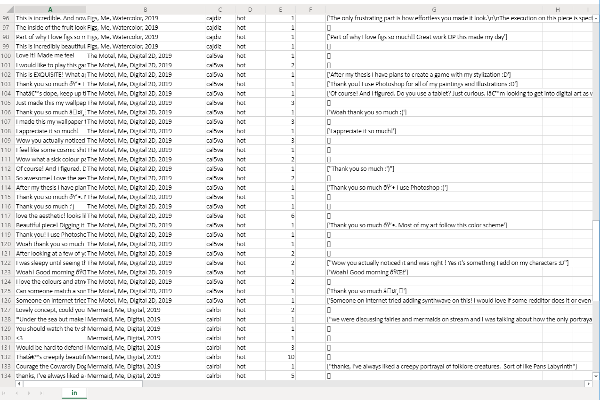

# Reddit_Comment_Scraper_To_Csv
This repo is supposed to get a list of all comments in a reddit thread and the direct replies to those comments and put them into a csv.

The art0.csv is supposed to be an example of the format you can expect with this code.

 **The Dependencies are:** 

  praw
  
  pandas
  
  Pyhton 3 -> Besides print statements very little would likely need to be changed for Python2.7
  
  must have a praw.ini file as well for accessing the reddit API:
  
  **Example praw.ini**:
  
    [DEFAULT]
    
;this is your 14 character personal use script, no quotes

client_id = ""

; this is your 27 character secret also from Reddit API, no quotes

client_secret=''

; this is the name you gave your application, no quotes

user_agent=''

; this is username for the reddit account the app was created with, no quotes

username=''

; password for the account, no quotes

password=''
  

**TO DO:** As You can see from the image, Reddit has some alphanumerics that do not play well with python or Praw, I will need to work on that 
to get higher quality data for ML projects 
